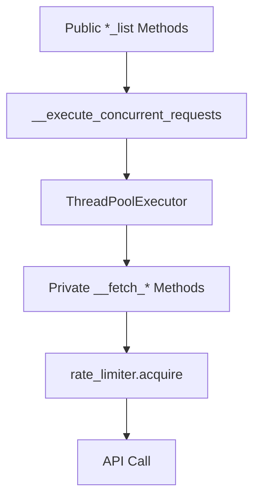

# API 호출 메서드 목록 및 분석

## 개요
`__execute_concurrent_requests`를 통해 병렬 처리되는 API 호출 메서드들의 목록과 구조를 분석합니다.

## 병렬 처리 메서드 구조



## API 호출 메서드 목록

### 1. Public 메서드 (병렬 처리 진입점)

| Public 메서드 | 매개변수 | 내부 호출 메서드 | 설명 |
|--------------|---------|----------------|------|
| `fetch_price_list` | `stock_list` | `__fetch_price` | 주식 현재가 조회 |
| `fetch_price_detail_oversea_list` | `stock_market_list` | `__fetch_price_detail_oversea` | 해외주식 현재가 상세 |
| `fetch_stock_info_list` | `stock_market_list` | `__fetch_stock_info` | 주식 정보 조회 |
| `fetch_search_stock_info_list` | `stock_market_list` | `__fetch_search_stock_info` | 국내 주식 정보 검색 |

### 2. Private 메서드 (실제 API 호출)

#### 2.1 `__fetch_price(symbol: str, market: str = "KR") -> dict`
- **Rate Limiter**: ❌ 사용 안 함
- **상태**: ✅ 구현됨 (원복됨)
- **특징**: 
  - 종목 타입에 따라 다른 메서드 호출
  - 내부적으로 `__fetch_stock_info` 먼저 호출
  - ETF: `fetch_etf_domestic_price` 호출
  - 일반 주식: `fetch_domestic_price` 호출
  - US 시장: `fetch_oversea_price` 호출
```python
def __fetch_price(self, symbol: str, market: str = "KR") -> dict:
    if market == "KR" or market == "KRX":
        stock_info = self.__fetch_stock_info(symbol, market)
        symbol_type = self.__get_symbol_type(stock_info)
        if symbol_type == "ETF":
            resp_json = self.fetch_etf_domestic_price("J", symbol)
        else:
            resp_json = self.fetch_domestic_price("J", symbol)
    elif market == "US":
        resp_json = self.fetch_oversea_price(symbol)
    else:
        raise ValueError("Unsupported market type")
    return resp_json
```

#### 2.2 `__fetch_price_detail_oversea(symbol: str, market: str = "KR")`
- **Rate Limiter**: ✅ 사용 (line 597)
- **API Path**: `/uapi/overseas-price/v1/quotations/price-detail`
- **TR ID**: `HHDFS76200200`
- **특징**: 
  - 해외 주식 전용 (KR/KRX 불가)
  - 여러 market_code 순회하며 시도

#### 2.3 `__fetch_stock_info(symbol: str, market: str = "KR")`
- **Rate Limiter**: ✅ 사용 (line 634)
- **API Path**: `uapi/domestic-stock/v1/quotations/search-info`
- **TR ID**: `CTPF1604R`
- **특징**: 국내/해외 주식 모두 지원

#### 2.4 `__fetch_search_stock_info(symbol: str, market: str = "KR")`
- **Rate Limiter**: ✅ 사용 (line 673)
- **API Path**: `uapi/domestic-stock/v1/quotations/search-stock-info`
- **TR ID**: `CTPF1002R`
- **특징**: 
  - 국내 주식만 지원 (KR/KRX만 가능)
  - 중복 선언 확인 필요 (line 333, 665)

## 문제점 및 개선 필요사항

### 1. 일관성 문제
- **Rate Limiter 사용 불일치**: 
  - 미사용: `__fetch_price`, `fetch_etf_domestic_price`, `fetch_domestic_price`
  - 사용: `__fetch_price_detail_oversea`, `__fetch_stock_info`, `__fetch_search_stock_info`
  - **문제점**: 동일한 API 서버에 요청하지만 일부만 Rate Limiting 적용
- **에러 처리 불일치**: 각 메서드마다 다른 에러 처리 방식
  - `fetch_etf_domestic_price`, `fetch_domestic_price`: 에러 처리 없음
  - `__fetch_stock_info`, `__fetch_search_stock_info`: try-except
  - `__fetch_price_detail_oversea`: resp_json 체크만

### 2. 구현 문제
- **`fetch_search_stock_info_list` 중복 선언 확인됨** (line 333, 665)
  - 두 메서드 모두 동일한 구현 (`__fetch_search_stock_info` 호출)
  - 첫 번째 선언 (line 333)이 실제 사용됨
  - 두 번째 선언은 제거 필요

### 3. 병렬 처리 흐름

```python
# 현재 흐름
fetch_*_list(stock_list)
    ↓
__execute_concurrent_requests(method, stock_list)
    ↓ (배치 크기: 5)
ThreadPoolExecutor.submit() × 5
    ↓ (동시 실행)
__fetch_*(symbol, market) × 5
    ↓ (각각 호출)
rate_limiter.acquire() × 5  # 경쟁 상태!
```

### 4. API 호출 패턴 분석

| 메서드 | 국내 | 해외 | Rate Limiting | 에러 처리 |
|--------|------|------|--------------|----------|
| `__fetch_price` | ? | ? | ❌ | NotImplementedError |
| `__fetch_price_detail_oversea` | ❌ | ✅ | ✅ | resp_json 체크 |
| `__fetch_stock_info` | ✅ | ✅ | ✅ | try-except |
| `__fetch_search_stock_info` | ✅ | ❌ | ✅ | try-except |

## 권장 개선사항

### 1. 즉시 수정 필요
- [ ] Rate Limiter 미적용 메서드에 추가
  - `__fetch_price` (내부에서 `__fetch_stock_info` 호출하므로 중복 방지 필요)
  - `fetch_etf_domestic_price`
  - `fetch_domestic_price`
- [ ] 모든 메서드에 일관된 rate_limiter 적용
- [ ] 중복 메서드 제거 (`fetch_search_stock_info_list` 두 번째 선언)

### 2. 에러 처리 통일
```python
def __fetch_generic(self, symbol: str, market: str, api_path: str, tr_id: str):
    """통일된 API 호출 패턴"""
    self.rate_limiter.acquire()
    
    try:
        # API 호출
        resp = requests.get(...)
        resp_json = resp.json()
        
        # 통일된 에러 체크
        if resp_json.get('rt_cd') != API_RETURN_CODE['SUCCESS']:
            if resp_json.get('msg_cd') == 'EGW00201':
                raise RateLimitError()
            raise APIError(resp_json.get('msg1'))
        
        return resp_json
        
    except Exception as e:
        # 통일된 에러 처리
        logger.error(f"API call failed: {symbol}, {e}")
        raise
```

### 3. 병렬 처리 개선
- 세마포어로 동시 호출 제한
- Rate limit 에러 시 자동 재시도
- 에러 발생 시에도 나머지 요청 계속 처리

### 3. 추가 API 메서드 (직접 호출)

#### 3.1 `fetch_etf_domestic_price(market_code: str, symbol: str) -> dict`
- **Rate Limiter**: ❌ 사용 안 함
- **API Path**: `uapi/domestic-stock/v1/quotations/inquire-price`
- **TR ID**: `FHPST02400000`
- **특징**: 
  - ETF 전용 국내 현재가 조회
  - 직접 호출 가능한 Public 메서드
  - `__fetch_price`에서 ETF 종목일 때 호출됨

#### 3.2 `fetch_domestic_price(market_code: str, symbol: str) -> dict`
- **Rate Limiter**: ❌ 사용 안 함
- **API Path**: `uapi/domestic-stock/v1/quotations/inquire-price`
- **TR ID**: `FHKST01010100`
- **특징**: 
  - 일반 주식 국내 현재가 조회
  - 직접 호출 가능한 Public 메서드
  - `__fetch_price`에서 일반 주식일 때 호출됨

#### 3.3 `__get_symbol_type(symbol_info)`
- **Rate Limiter**: N/A (API 호출 없음)
- **특징**: 
  - Private 헬퍼 메서드
  - 종목 분류 판별: Stock/ETF/Unknown
  - 지원 종목 타입:
    - Stock: '주권', '상장REITS', '사회간접자본투융자회사'
    - ETF: 'ETF'

### 4. API 호출 패턴 분석

| 메서드 | 국내 | 해외 | Rate Limiting | 에러 처리 |
|--------|------|------|--------------|----------|
| `__fetch_price` | ✅ | ✅ | ❌ | ValueError |
| `__fetch_price_detail_oversea` | ❌ | ✅ | ✅ | resp_json 체크 |
| `__fetch_stock_info` | ✅ | ✅ | ✅ | try-except |
| `__fetch_search_stock_info` | ✅ | ❌ | ✅ | try-except |
| `fetch_etf_domestic_price` | ✅ | ❌ | ❌ | 없음 |
| `fetch_domestic_price` | ✅ | ❌ | ❌ | 없음 |

## 결론

현재 API 호출 메서드 중 절반만 Rate Limiting이 적용되어 있으며, 각 메서드마다 에러 처리 방식이 다릅니다. 특히 `__fetch_price`는 내부적으로 다른 API 호출 메서드를 호출하는 구조로, Rate Limiting 중복 적용에 주의가 필요합니다. 일관성 있는 구현과 에러 처리 통일이 시급합니다. 