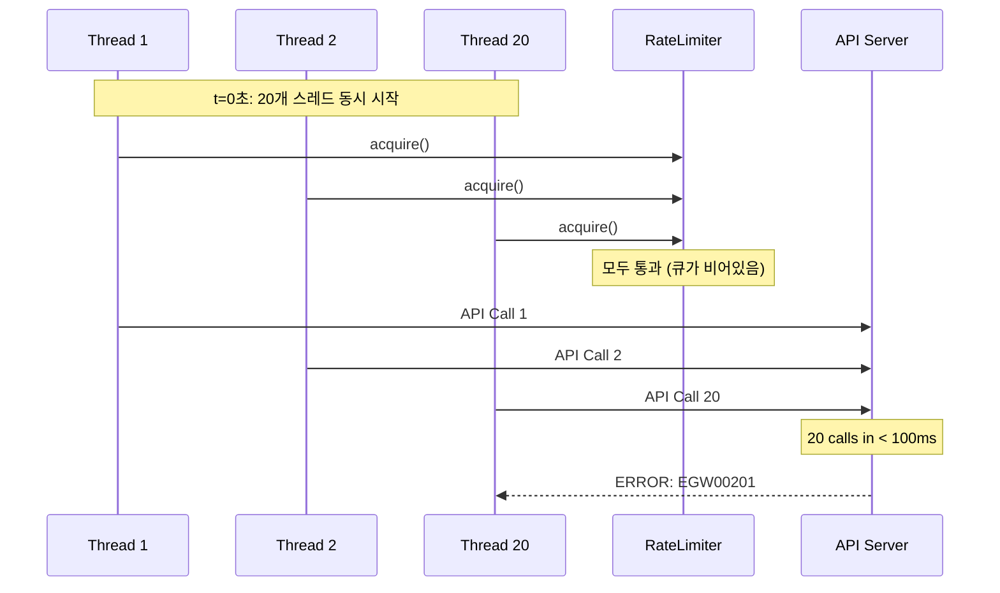

# Rate Limit 에러 발생 패턴 분석

## 개요
한국투자증권 API의 Rate Limit 에러(EGW00201) 발생 패턴을 분석하고 원인을 파악합니다.

## 에러 발생 시나리오

### 1. 동시 버스트 패턴


**문제점**:
- 초기 시작 시 timestamp queue가 비어있어 20개 스레드가 동시에 통과
- API 서버는 실제로는 100ms 내 20개 호출로 인식
- 클라이언트는 1초 내로 판단하지만 서버는 더 짧은 시간 윈도우 사용

### 2. 슬라이딩 윈도우 vs 고정 윈도우 불일치
```
Client (Sliding Window):
|----1초----|----1초----|
[19 calls  ][20th call  ] → 허용 (1초 내 20개)

Server (Fixed Window):
|----1초----|----1초----|
[19 calls  |20th call   ] → 거부 (새 윈도우에서 이미 19개)
     ↑ 0.9초         ↑ 1.1초
```

**문제점**:
- 클라이언트는 슬라이딩 윈도우로 "지난 1초" 계산
- 서버는 고정 윈도우로 "현재 초" 계산
- 윈도우 경계에서 불일치 발생

### 3. 배치 처리 시 집중 호출
```python
# 현재 구현
def __execute_concurrent_requests(self, method, stock_list):
    batch_size = 5
    for batch in batches:
        futures = []
        for item in batch:
            future = executor.submit(method, item)  # 5개 동시 제출
            futures.append(future)
        
        time.sleep(0.2)  # 200ms 대기
```

**타임라인**:
```
0ms:    Batch 1 (5 calls) → 동시 발생
200ms:  Batch 2 (5 calls) → 동시 발생  
400ms:  Batch 3 (5 calls) → 동시 발생
600ms:  Batch 4 (5 calls) → 동시 발생
800ms:  20 calls completed
```

**문제점**:
- 배치 내 5개 요청이 거의 동시에 발생
- 200ms 간격으로 버스트 발생
- 네트워크 지연으로 서버에서는 더 집중되어 보일 수 있음

### 4. 네트워크 지연 영향
```mermaid
graph LR
    A[acquire() 통과<br/>t=0ms] --> B[네트워크 지연<br/>10-50ms]
    B --> C[서버 도착<br/>t=10-50ms]
    C --> D[서버 처리]
    
    E[acquire() 통과<br/>t=50ms] --> F[네트워크 지연<br/>10-50ms]
    F --> G[서버 도착<br/>t=60-100ms]
    
    Note1[클라이언트: 50ms 간격] -.-> A
    Note2[서버: 10ms 간격으로 인식] -.-> D
```

## 실제 에러 발생 조건 추정

### 1. API 서버의 Rate Limiting 방식
- **윈도우 타입**: Fixed Window (1초 단위)
- **제한**: 초당 20 calls
- **카운터 리셋**: 매 초 시작 시점
- **여유 없음**: 정확히 20개에서 차단

### 2. 에러 발생 확률이 높은 경우
1. **대량 종목 조회** (100개 이상)
   - 짧은 시간에 많은 요청 발생
   - 배치 처리로도 버스트 발생

2. **여러 사용자 동시 사용**
   - 같은 API 키로 여러 프로세스 실행
   - 전체 Rate Limit 공유

3. **네트워크 불안정**
   - 재시도로 인한 추가 요청
   - 지연으로 인한 요청 집중

## 로깅 추가 제안

### 1. Rate Limiter 로깅
```python
def acquire(self):
    with self.lock:
        now = time.time()
        
        # 로깅 추가
        logger.debug(f"RateLimiter.acquire() called at {now}")
        logger.debug(f"Current queue size: {len(self.call_timestamps)}")
        logger.debug(f"Available tokens: {self.tokens}")
        
        # 대기 시간 로깅
        if wait_time > 0:
            logger.info(f"Rate limit reached, waiting {wait_time:.3f}s")
```

### 2. API 호출 로깅
```python
def __fetch_price_detail_oversea(self, symbol: str, market: str = "KR"):
    start_time = time.time()
    self.rate_limiter.acquire()
    acquire_time = time.time()
    
    # API 호출
    resp = requests.get(url, headers=headers, params=params)
    response_time = time.time()
    
    # 시간 측정 로깅
    logger.info(f"API Call timing - Symbol: {symbol}, "
                f"Acquire wait: {acquire_time - start_time:.3f}s, "
                f"API response: {response_time - acquire_time:.3f}s")
    
    # 에러 응답 로깅
    if resp_json.get('msg_cd') == 'EGW00201':
        logger.error(f"Rate limit error for {symbol} at {response_time}")
        logger.error(f"Response: {resp_json}")
```

### 3. 통계 수집
```python
class APICallStats:
    def __init__(self):
        self.call_times = []
        self.error_times = []
        self.wait_times = []
    
    def record_call(self, timestamp, wait_time, success):
        self.call_times.append(timestamp)
        self.wait_times.append(wait_time)
        if not success:
            self.error_times.append(timestamp)
    
    def analyze(self):
        # 초당 호출 분포
        calls_per_second = defaultdict(int)
        for t in self.call_times:
            calls_per_second[int(t)] += 1
        
        # 에러 발생 패턴
        error_pattern = {
            "total_errors": len(self.error_times),
            "error_rate": len(self.error_times) / len(self.call_times),
            "max_calls_before_error": self._find_burst_before_error()
        }
        
        return {
            "calls_per_second": dict(calls_per_second),
            "error_pattern": error_pattern,
            "avg_wait_time": sum(self.wait_times) / len(self.wait_times)
        }
```

## 해결 방향

### 1. 즉시 적용 가능한 개선
- **초기 버스트 방지**: 시작 시 의도적으로 분산
- **배치 내 순차 제출**: 동시 제출 대신 50ms 간격
- **보수적 설정**: max_calls=15, safety_margin=0.8

### 2. 구조적 개선
- **Token Bucket 추가**: 버스트 제어
- **고정 윈도우 시뮬레이션**: 서버와 동일한 방식
- **지수 백오프**: 에러 시 자동 재시도

### 3. 모니터링 강화
- **실시간 통계**: 초당 호출 수 추적
- **에러 패턴 분석**: 에러 발생 조건 파악
- **경고 시스템**: 한계 근접 시 알림

## 결론

현재 구현의 주요 문제는:
1. 초기 및 배치 시작 시 버스트 발생
2. 클라이언트-서버 간 윈도우 방식 불일치  
3. 네트워크 지연 미고려
4. 에러 발생 시 재시도 없음

이를 해결하려면 보수적인 Rate Limiting과 에러 처리 메커니즘이 필요합니다. 