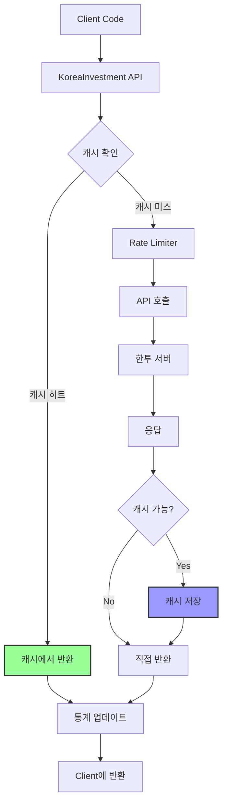

# 한국투자증권 API 라이브러리 - TTL 캐시 기능 요구사항

## 1. 개요

### 1.1 배경
Rate Limiting 개선과 함께 API 호출 횟수를 근본적으로 줄이기 위한 캐싱 메커니즘이 필요합니다. 동일한 데이터를 반복 조회하는 경우가 많아, 적절한 캐싱을 통해 성능 향상과 Rate Limit 부담 감소를 동시에 달성할 수 있습니다.

### 1.2 목표
- API 호출 횟수를 30-50% 감소
- 응답 속도 향상 (캐시 히트 시 < 1ms)
- 데이터 신선도와 성능의 균형 유지
- 메모리 사용량 제어

## 2. 캐시 적용 대상 분석

### 2.1 캐시 가능 API
| API 메서드 | 추천 TTL | 캐시 키 | 비고 |
|-----------|---------|---------|-----|
| `fetch_price()` | 1-5초 | symbol + market | 실시간성 중요 |
| `fetch_oversea_price()` | 5-10초 | symbol + exchange | 해외는 지연 존재 |
| `fetch_daily_price()` | 5분-1시간 | symbol + period + count | 과거 데이터는 변경 없음 |
| `fetch_minute_price()` | 30초-1분 | symbol + period | 분봉은 자주 업데이트 |
| `get_market_cap()` | 1시간 | symbol | 시가총액은 천천히 변함 |
| `get_stock_info()` | 24시간 | symbol | 종목 정보는 거의 불변 |

### 2.2 캐시 불가 API
| API 메서드 | 이유 |
|-----------|-----|
| `fetch_balance()` | 실시간 잔고 정보 |
| `create_*_order()` | 주문 실행 |
| `cancel_order()` | 주문 취소 |
| `fetch_orders()` | 주문 내역 (실시간) |

## 3. 기능 요구사항

### 3.1 TTL 캐시 구현

```python
class TTLCache:
    def __init__(self, default_ttl: int = 60, max_size: int = 10000):
        """
        Args:
            default_ttl: 기본 TTL (초)
            max_size: 최대 캐시 항목 수
        """
        self._cache: Dict[str, CacheEntry] = {}
        self._default_ttl = default_ttl
        self._max_size = max_size
        self._lock = threading.RLock()
        self._access_count = defaultdict(int)
        self._hit_count = 0
        self._miss_count = 0

class CacheEntry:
    def __init__(self, value: Any, ttl: int):
        self.value = value
        self.expires_at = time.time() + ttl
        self.created_at = time.time()
        self.access_count = 0
        self.last_accessed = time.time()
```

### 3.2 캐시 정책

#### 3.2.1 TTL 전략
```python
# API별 기본 TTL 설정
CACHE_TTL_CONFIG = {
    'fetch_price': 3,              # 3초
    'fetch_oversea_price': 10,     # 10초
    'fetch_daily_price': 300,      # 5분
    'fetch_minute_price': 60,      # 1분
    'get_market_cap': 3600,        # 1시간
    'get_stock_info': 86400,       # 24시간
}

# 장 시간대별 동적 TTL
def get_dynamic_ttl(method_name: str, market_hours: bool) -> int:
    base_ttl = CACHE_TTL_CONFIG.get(method_name, 60)
    if market_hours:
        return base_ttl
    else:
        return base_ttl * 3  # 장외 시간은 3배 TTL
```

#### 3.2.2 캐시 키 생성
```python
def generate_cache_key(method_name: str, *args, **kwargs) -> str:
    """
    메서드명과 파라미터를 조합하여 유니크한 캐시 키 생성
    
    예시:
    - fetch_price:005930:KR
    - fetch_daily_price:005930:D:100
    - get_market_cap:AAPL:NASD
    """
    key_parts = [method_name]
    key_parts.extend(str(arg) for arg in args)
    key_parts.extend(f"{k}={v}" for k, v in sorted(kwargs.items()))
    return ":".join(key_parts)
```

### 3.3 캐시 데코레이터

```python
def cacheable(ttl: Optional[int] = None, 
              cache_condition: Optional[Callable] = None,
              key_generator: Optional[Callable] = None):
    """
    메서드에 캐싱 기능을 추가하는 데코레이터
    
    Args:
        ttl: 이 메서드의 TTL (None이면 기본값 사용)
        cache_condition: 캐시 여부를 결정하는 함수
        key_generator: 커스텀 캐시 키 생성 함수
    
    사용 예:
    @cacheable(ttl=5)
    def fetch_price(self, symbol: str) -> dict:
        ...
    
    @cacheable(cache_condition=lambda result: result.get('rt_cd') == '0')
    def fetch_daily_price(self, symbol: str) -> dict:
        ...
    """
```

### 3.4 캐시 관리 기능

#### 3.4.1 수동 캐시 제어
```python
class KoreaInvestment:
    def clear_cache(self, pattern: Optional[str] = None):
        """특정 패턴의 캐시 또는 전체 캐시 삭제"""
        
    def get_cache_stats(self) -> dict:
        """캐시 통계 조회"""
        return {
            'hit_rate': self._cache.hit_rate,
            'total_entries': len(self._cache),
            'memory_usage': self._cache.memory_usage,
            'expired_count': self._cache.expired_count,
        }
    
    def set_cache_enabled(self, enabled: bool):
        """캐시 기능 on/off"""
        
    def preload_cache(self, symbols: List[str]):
        """자주 사용하는 종목 미리 캐싱"""
```

#### 3.4.2 자동 정리
```python
class TTLCache:
    def _cleanup_expired(self):
        """만료된 항목 자동 제거 (백그라운드 스레드)"""
        
    def _evict_lru(self):
        """LRU(Least Recently Used) 정책으로 제거"""
        
    def _evict_lfu(self):
        """LFU(Least Frequently Used) 정책으로 제거"""
```

### 3.5 메모리 관리

#### 3.5.1 크기 제한
```python
class CacheSizeLimit:
    MAX_ENTRIES = 10000  # 최대 항목 수
    MAX_MEMORY_MB = 100  # 최대 메모리 사용량 (MB)
    
    def check_limits(self) -> bool:
        """크기 제한 확인 및 필요시 제거"""
```

#### 3.5.2 메모리 효율적 저장
```python
# 큰 응답은 압축하여 저장
def _store_value(self, value: Any) -> Any:
    if sys.getsizeof(value) > 1024:  # 1KB 이상
        return zlib.compress(pickle.dumps(value))
    return value

def _retrieve_value(self, stored: Any) -> Any:
    if isinstance(stored, bytes):
        return pickle.loads(zlib.decompress(stored))
    return stored
```

## 4. 통합 아키텍처



## 5. 구현 예시

### 5.1 기본 사용법
```python
# 캐시 활성화 (기본값)
broker = KoreaInvestment(api_key, api_secret, acc_no, cache_enabled=True)

# 캐시 비활성화
broker = KoreaInvestment(api_key, api_secret, acc_no, cache_enabled=False)

# 커스텀 캐시 설정
cache_config = {
    'default_ttl': 60,
    'max_size': 5000,
    'ttl_config': {
        'fetch_price': 5,
        'fetch_daily_price': 600,
    }
}
broker = KoreaInvestment(api_key, api_secret, acc_no, cache_config=cache_config)
```

### 5.2 고급 사용법
```python
# 특정 호출에 대해 캐시 무시
price = broker.fetch_price("005930", use_cache=False)

# 캐시 통계 확인
stats = broker.get_cache_stats()
print(f"캐시 적중률: {stats['hit_rate']:.1%}")

# 특정 종목 캐시 삭제
broker.clear_cache("fetch_price:005930:*")

# 자주 사용하는 종목 미리 로드
top_symbols = ["005930", "000660", "035720"]
broker.preload_cache(top_symbols)
```

## 6. 성능 목표

### 6.1 캐시 성능
- 캐시 조회 시간: < 0.1ms
- 캐시 저장 시간: < 1ms
- 메모리 오버헤드: < 100MB (10,000 항목 기준)

### 6.2 전체 시스템 영향
- API 호출 감소율: 30-50%
- 평균 응답 시간 개선: 50-70%
- Rate Limit 에러 감소: 추가 20-30%

## 7. 모니터링 및 로깅

### 7.1 캐시 메트릭
```python
cache_metrics = {
    'hit_rate': float,          # 캐시 적중률
    'miss_rate': float,         # 캐시 미스율
    'eviction_count': int,      # 제거된 항목 수
    'avg_entry_age': float,     # 평균 항목 나이
    'memory_usage_mb': float,   # 메모리 사용량
    'api_calls_saved': int,     # 절약된 API 호출 수
}
```

### 7.2 로깅
```python
# 캐시 히트/미스 로깅
logger.debug(f"Cache HIT for {cache_key}")
logger.debug(f"Cache MISS for {cache_key}, calling API")

# 주기적 통계 로깅
logger.info(f"Cache stats - Hit rate: {hit_rate:.1%}, Size: {cache_size}")
```

## 8. 테스트 계획

### 8.1 단위 테스트
- TTL 만료 테스트
- LRU/LFU 제거 정책 테스트
- 동시성 테스트 (멀티스레드)
- 메모리 제한 테스트

### 8.2 통합 테스트
- Rate Limiter와 함께 동작 테스트
- 캐시 워밍업 시나리오
- 장시간 실행 메모리 누수 테스트

### 8.3 성능 테스트
- 캐시 적중률 측정
- API 호출 감소율 측정
- 응답 시간 개선 측정

## 9. 구현 우선순위

1. **Phase 1 (핵심)**
   - 기본 TTL 캐시 구현
   - 주요 조회 API에 적용
   - 캐시 통계 수집

2. **Phase 2 (확장)**
   - 동적 TTL 조정
   - 고급 제거 정책 (LRU/LFU)
   - 캐시 워밍업 기능

3. **Phase 3 (최적화)**
   - 메모리 압축
   - 분산 캐시 지원
   - 영구 저장소 연동

## 10. 주의사항

### 10.1 데이터 일관성
- 실시간성이 중요한 데이터는 짧은 TTL 또는 캐시 제외
- 주문/잔고 관련 API는 절대 캐시하지 않음

### 10.2 메모리 관리
- 대량 데이터 캐싱 시 메모리 사용량 모니터링 필수
- 적절한 제거 정책으로 메모리 오버플로우 방지

### 10.3 장애 대응
- 캐시 장애 시에도 정상 동작 보장
- 캐시는 성능 향상 도구일 뿐, 필수 의존성 아님 