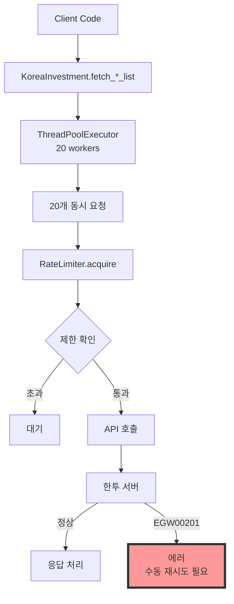
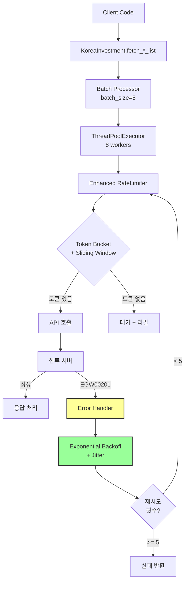
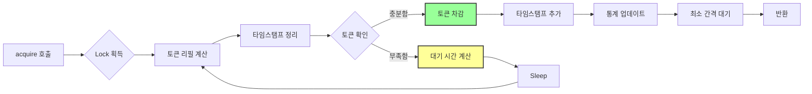
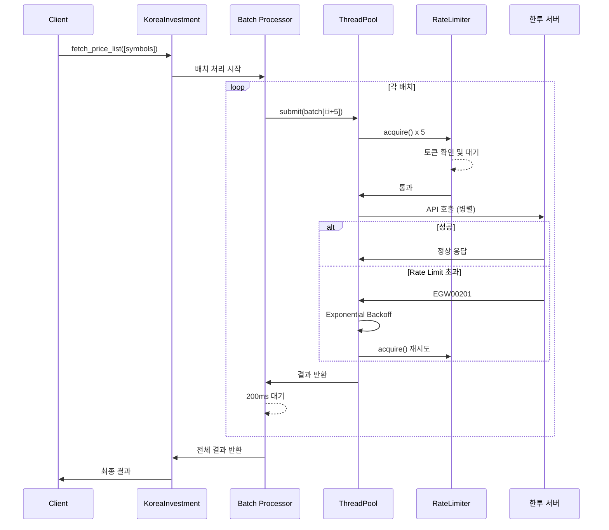

# 한국투자증권 API 라이브러리 - Rate Limiting 개선 PRD

## 1. 개요

### 1.1 문제 정의
현재 한국투자증권 API 라이브러리 사용 시 API 호출 제한(초당 20회)을 초과하여 `EGW00201` 에러가 간헐적으로 발생하고 있습니다.

### 1.2 목표
- API 호출 제한 초과 에러를 최소화
- 안정적이고 예측 가능한 API 호출 패턴 구현
- 에러 발생 시 자동 복구 메커니즘 제공

## 2. 현재 상황 분석

### 2.1 발견된 문제점
1. **동시성 버스트**: 20개 스레드가 동시에 API 호출하여 순간적 제한 초과
2. **시간 계산 방식 차이**: 클라이언트(슬라이딩 윈도우) vs 서버(고정 윈도우)
3. **안전 마진 부재**: 정확히 20회/초로 설정하여 여유 없음
4. **네트워크 지연 미고려**: rate_limiter.acquire()와 실제 API 호출 간 시간차

### 2.2 API 특성
- 초당 호출 제한: 20회
- Rate limit 헤더 미제공 (X-RateLimit-Remaining 없음)
- 초과 시 응답: `msg_cd: EGW00201`

### 2.3 현재 구조 다이어그램



### 2.4 슬라이딩 윈도우 vs 고정 윈도우

```mermaid
gantt
    title Rate Limiting 방식 비교 (20회/초 제한)
    dateFormat HH:mm:ss
    axisFormat %S
    
    section 고정 윈도우 (서버)
    초 0-1    :done,    server1, 00:00:00, 1s
    초 1-2    :done,    server2, 00:00:01, 1s
    초 2-3    :active,  server3, 00:00:02, 1s
    
    section 슬라이딩 윈도우 (클라이언트)
    현재 시점에서 1초 전까지 :crit, client1, 00:00:00.5, 1s
    다음 시점에서 1초 전까지 :crit, client2, 00:00:01.5, 1s
    
    section 문제 상황
    0.9초에 19회 호출    :milestone, prob1, 00:00:00.9, 0
    1.1초에 19회 호출    :milestone, prob2, 00:00:01.1, 0
```

**문제점 설명:**
- 서버 (고정 윈도우): 각 초마다 카운터 리셋 (0-1초, 1-2초...)
- 클라이언트 (슬라이딩 윈도우): 현재 시점에서 1초 전까지 계산
- 0.9초에 19회 + 1.1초에 19회 = 0.2초 동안 38회 → 서버 입장에서 초당 제한 초과!

## 3. 기능 요구사항

### 3.1 하이브리드 Rate Limiting
- **Token Bucket + Sliding Window 방식 병행 구현**
  - Token Bucket: 버스트 제어 및 균등 분산
  - Sliding Window: 정확한 시간 윈도우 계산
- **구현 상세**:
  ```python
  class RateLimiter:
      def __init__(self, max_calls, per_seconds, safety_margin=0.9):
          self.max_calls = int(max_calls * safety_margin)
          self.tokens = self.max_calls
          self.refill_rate = self.max_calls / self.per_seconds
  ```

### 3.2 보수적 설정값
- **기본 설정**:
  - max_calls: 15 (기존 20에서 감소)
  - safety_margin: 0.8 (실제 12회/초)
  - max_workers: 8 (기존 20에서 감소)
- **설정 가능한 파라미터**:
  - 사용자가 더 보수적인 값으로 조정 가능
  - 환경별(개발/운영) 다른 설정 지원

### 3.3 배치 처리
- **구현 요구사항**:
  - 배치 크기: 5개 (조정 가능)
  - 배치 간 대기 시간: 200ms
  - 동시 처리 제한으로 버스트 방지
- **코드 예시**:
  ```python
  def __execute_concurrent_requests(self, method, stock_list):
      batch_size = 5
      for i in range(0, len(stock_list), batch_size):
          # 배치 처리 로직
  ```

### 3.4 최소 간격 보장
- **각 API 호출 후 최소 대기 시간 적용**:
  - 계산식: `min_interval = per_seconds / (max_calls * 1.2)`
  - 약 69ms 대기 (12회/초 기준)
- **균등 분산 효과**

### 3.5 에러 핸들링 및 재시도
- **EGW00201 에러 감지**:
  ```python
  if resp_json.get('msg_cd') == 'EGW00201':
      # API 호출 수 초과 처리
  ```
- **Exponential Backoff 구현**:
  - 초기 대기: 1초
  - 최대 대기: 32초
  - 백오프 배수: 2
  - 재시도 횟수: 5회
- **구현 예시**:
  ```python
  def handle_rate_limit_error(self, retry_count):
      wait_time = min(2 ** retry_count, 32)  # 1, 2, 4, 8, 16, 32초
      jitter = random.uniform(0, 0.1 * wait_time)  # 지터 추가
      time.sleep(wait_time + jitter)
  ```

### 3.6 개선된 아키텍처 다이어그램



### 3.5 RateLimiter 내부 동작



### 3.6 전체 흐름 시퀀스 다이어그램



## 4. 비기능 요구사항

### 4.1 성능
- Rate limit 에러 발생률: 1% 미만 목표
- 평균 API 호출 처리량: 10-12회/초 유지

### 4.2 모니터링
- Rate limit 통계 실시간 출력
- 에러 발생 시 상세 로그
- 호출 패턴 분석 기능

### 4.3 호환성
- 기존 API 인터페이스 유지
- 하위 호환성 보장

## 5. 구현 우선순위

1. **P0 (필수)**:
   - 하이브리드 Rate Limiting
   - EGW00201 에러 핸들링
   - Exponential Backoff

2. **P1 (권장)**:
   - 배치 처리
   - 보수적 설정값
   - 최소 간격 보장

3. **P2 (선택)**:
   - 상세 모니터링
   - 환경별 설정
   - 동적 조정 기능

## 6. 테스트 시나리오

### 6.1 단위 테스트
- RateLimiter 클래스 동작 검증
- Token Bucket 리필 로직
- Exponential Backoff 계산

### 6.2 통합 테스트
- 대량 요청 시나리오 (100개 종목)
- 에러 발생 및 복구 시나리오
- 장시간 실행 안정성

### 6.3 부하 테스트
- 최대 처리량 측정
- 에러율 확인
- 응답 시간 분석

## 7. 배포 계획

### 7.1 단계적 배포
1. 개발 환경 테스트
2. 일부 사용자 베타 테스트
3. 전체 배포

### 7.2 롤백 계획
- 기존 코드 백업
- 설정값만 변경하여 즉시 롤백 가능

## 8. 성공 지표

- API 호출 에러율: < 1%
- 평균 처리 속도: 10-12 TPS
- 사용자 만족도: 에러 관련 이슈 90% 감소

## 9. 향후 개선사항

- 동적 Rate Limit 조정
- 서버 응답 시간 기반 적응형 대기
- 다중 계정 지원 시 계정별 Rate Limit 관리

## 10. 추가 기능

### 10.1 TTL 캐시 기능
API 호출 횟수를 근본적으로 줄이기 위한 캐싱 메커니즘이 추가로 계획되어 있습니다.

- **목표**: API 호출 30-50% 감소
- **주요 기능**: 
  - API별 맞춤 TTL 설정
  - 메모리 효율적 관리
  - 캐시 통계 및 모니터링
- **상세 요구사항**: [prd-27-cache.md](./prd-27-cache.md) 참조

---

_마지막 업데이트: 2024-12-28_
