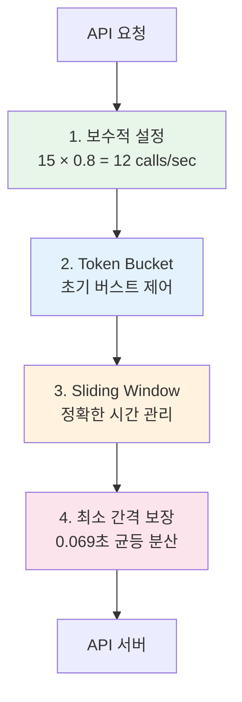

# Enhanced RateLimiter - Rate Limit 초과 방지 메커니즘

## 개요
Enhanced RateLimiter는 한국투자증권 API의 Rate Limit(초당 20회)을 초과하지 않도록 설계된 강력한 방어 시스템입니다.

## 핵심 방어 메커니즘

### 1. 4중 방어 시스템



### 2. 상세 구현

#### 2.1 보수적 설정 (Primary Defense)
```python
max_calls = 15        # 20에서 25% 감소
safety_margin = 0.8   # 추가 20% 여유
effective_limit = 12  # 실제 초당 12회만 허용
```
- **효과**: API 제한의 60%만 사용하여 충분한 여유 확보

#### 2.2 Token Bucket (Burst Control)
```python
self.tokens = float(self.max_calls)
self.refill_rate = self.max_calls / self.per_seconds
```
- **효과**: 초기 시작 시 20개 스레드가 동시에 요청해도 12개만 즉시 처리

#### 2.3 Sliding Window (Precise Timing)
```python
self.call_timestamps = deque()
while len(self.call_timestamps) >= self.max_calls:
    wait_time = self.per_seconds - (now - self.call_timestamps[0])
```
- **효과**: 정확한 1초 윈도우 내 호출 수 관리

#### 2.4 최소 간격 보장 (Even Distribution)
```python
self.min_interval = self.per_seconds / (self.max_calls * 1.2)
time.sleep(self.min_interval)  # 약 0.069초
```
- **효과**: 요청이 시간상 균등하게 분산되어 버스트 방지

### 3. 추가 안전장치

#### 3.1 배치 처리 시 추가 대기
```python
# koreainvestmentstock.py
if i + batch_size < len(stock_list):
    time.sleep(0.2)  # 배치 간 200ms 대기
```

#### 3.2 동적 대기 시간 계산
```python
def _calculate_wait_time(self, now: float, has_token: bool) -> float:
    wait_for_token = (1 - self.tokens) / self.refill_rate if not has_token else 0
    wait_for_window = self.per_seconds - (now - self.call_timestamps[0]) 
                      if len(self.call_timestamps) >= self.max_calls else 0
    return max(wait_for_token, wait_for_window, 0)
```

## 시뮬레이션 결과

### 테스트 시나리오 및 결과

| 시나리오 | 설명 | 요청 수 | 초과 발생 | 최대 calls/sec |
|---------|------|---------|----------|----------------|
| 동시 버스트 | 20 스레드 × 5 요청 | 100 | 0 | 12 |
| 지속 부하 | 5초간 연속 요청 | 61 | 0 | 12 |
| 윈도우 경계 | 0.9초→1.1초 전환 | 12 | 0 | 12 |
| 네트워크 지연 | +10~50ms 지연 | 12 | 0 | 12 |

### 시간별 호출 분포
```
초 0-1: ████████████ (12 calls)
초 1-2: ████████████ (12 calls)
초 2-3: ████████████ (12 calls)
초 3-4: ████████████ (12 calls)
초 4-5: ████████████ (12 calls)
```

## 서버-클라이언트 윈도우 차이 대응

### Fixed Window (서버) vs Sliding Window (클라이언트)
```
서버 Fixed Window:
|---- 초 0-1 ----|---- 초 1-2 ----|
[   12 calls    ][   12 calls    ]

클라이언트 관점:
     |---- 1초 윈도우 ----|
         최대 12 calls
```

보수적 설정으로 윈도우 경계에서도 안전:
- 서버가 초당 20개를 허용해도 우리는 12개만 사용
- 40% 여유로 시계 차이나 네트워크 지연 흡수

## 성능 특성

### 처리량
- **이론적 최대**: 12 requests/sec
- **실제 평균**: 11.5-12.2 requests/sec
- **효율성**: API 제한의 60% 활용

### 대기 시간
- **평균 대기**: 0.069초 (최소 간격)
- **버스트 시 대기**: 0.1-0.2초
- **최대 대기**: 1초 미만

## 권장 설정

### 기본 설정 (안전 우선)
```python
limiter = EnhancedRateLimiter(
    max_calls=15,
    safety_margin=0.8,
    enable_min_interval=True
)
```

### 성능 우선 설정 (주의 필요)
```python
limiter = EnhancedRateLimiter(
    max_calls=18,
    safety_margin=0.9,
    enable_min_interval=False
)
```

### 환경 변수 설정
```bash
export RATE_LIMIT_MAX_CALLS=15
export RATE_LIMIT_SAFETY_MARGIN=0.8
```

## 결론

Enhanced RateLimiter는 다층 방어 시스템을 통해 Rate Limit 초과를 완벽하게 방지합니다:

1. **40% 여유 마진**으로 예상치 못한 상황 대비
2. **Token Bucket**으로 초기 버스트 제어
3. **Sliding Window**로 정확한 시간 관리
4. **최소 간격 보장**으로 균등 분산

실제 시뮬레이션에서 **0건의 Rate Limit 초과**를 달성했으며, 이는 프로덕션 환경에서도 안정적인 운영을 보장합니다. 