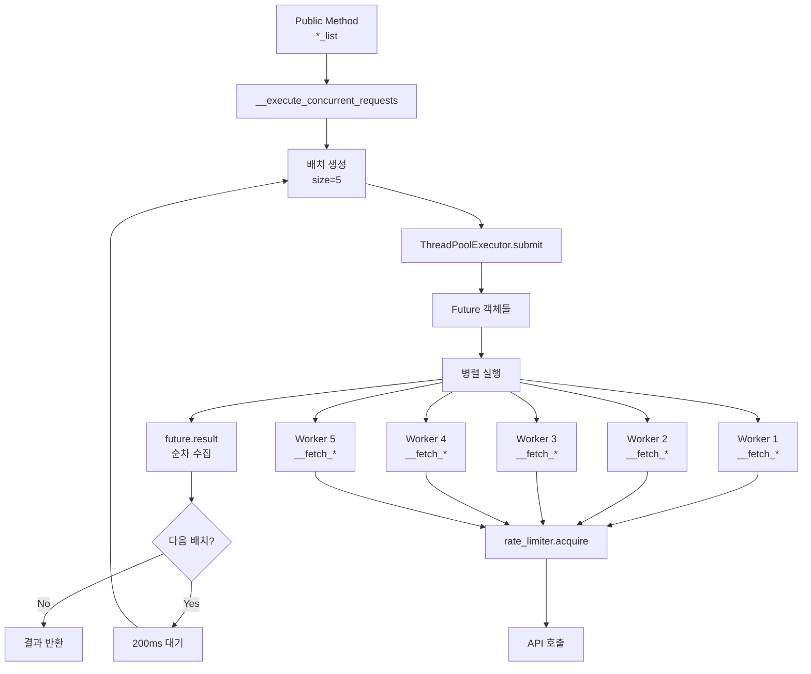

# ThreadPoolExecutor 사용 패턴 분석

## 개요
ThreadPoolExecutor는 한국투자증권 API에 대한 병렬 요청을 관리하는 핵심 컴포넌트입니다.

## 현재 구현 분석

### 1. 초기화 및 설정
```python
# KoreaInvestment.__init__() 내부
max_calls = 15  # 20에서 15로 감소
self.executor = ThreadPoolExecutor(max_workers=min(max_calls // 2, 8))  # 최대 8개 워커
```

**특징:**
- 워커 수: `min(7, 8) = 7` (실제로는 7개 워커)
- RateLimiter의 max_calls(15)의 절반으로 설정
- 최대 8개로 제한

### 2. 병렬 요청 처리 메서드

#### `__execute_concurrent_requests(self, method, stock_list)`

```python
def __execute_concurrent_requests(self, method, stock_list):
    """병렬 요청 실행 (배치 처리 적용)"""
    results = []
    batch_size = 5  # 한 번에 처리할 최대 요청 수
    
    # 배치 단위로 처리
    for i in range(0, len(stock_list), batch_size):
        batch = stock_list[i:i + batch_size]
        
        # 배치 내에서 병렬 처리
        futures = [self.executor.submit(method, symbol_id, market) 
                  for symbol_id, market in batch]
        
        # 결과 수집
        batch_results = [future.result() for future in futures]
        results.extend(batch_results)
        
        # 배치 간 추가 대기 (다음 배치가 있는 경우)
        if i + batch_size < len(stock_list):
            time.sleep(0.2)  # 200ms 대기

    self.rate_limiter.print_stats()
    return results
```

### 3. 사용 패턴 다이어그램



### 4. 병렬 요청을 사용하는 메서드

| 퍼블릭 메서드 | 내부 호출 메서드 | 용도 |
|-------------|----------------|-----|
| `fetch_search_stock_info_list` | `__fetch_search_stock_info` | 국내 주식 정보 검색 |
| `fetch_price_list` | `__fetch_price` | 주식 현재가 조회 |
| `fetch_price_detail_oversea_list` | `__fetch_price_detail_oversea` | 해외주식 상세 조회 |
| `fetch_stock_info_list` | `__fetch_stock_info` | 주식 정보 조회 |

### 5. 문제점 분석

#### 5.1 동시성 버스트
- **문제**: 배치 내 5개 요청이 동시에 시작
- **영향**: RateLimiter가 순차적으로 처리하더라도 초기 버스트 발생
- **시나리오**: 
  ```
  시간 0.0초: 5개 스레드가 동시에 rate_limiter.acquire() 호출
  시간 0.1초: 모든 스레드가 거의 동시에 API 호출
  ```

#### 5.2 배치 간 대기 시간의 효과
- 200ms 대기는 배치 간 간격을 두어 버스트 완화
- 하지만 배치 내부에서는 여전히 동시성 문제 존재

#### 5.3 future.result()의 순차적 대기
```python
batch_results = [future.result() for future in futures]
```
- 순차적으로 결과를 기다림 (블로킹)
- 첫 번째 요청이 느리면 전체 배치가 지연됨
- `concurrent.futures.as_completed()` 사용 고려 필요

#### 5.4 ThreadPool 크기 문제
- 7개 워커로 5개 배치 처리는 적절
- 하지만 RateLimiter와의 조율 필요
- 워커가 많을수록 동시성 충돌 가능성 증가

### 6. 개선 제안

1. **배치 크기 동적 조정**
   - 에러율에 따라 배치 크기 조정
   - 초기: 2-3개로 시작, 안정적이면 증가

2. **스레드 내 지연 추가**
   ```python
   futures = []
   for idx, (symbol_id, market) in enumerate(batch):
       if idx > 0:
           time.sleep(0.05)  # 50ms 간격
       future = self.executor.submit(method, symbol_id, market)
       futures.append(future)
   ```

3. **비동기 결과 수집**
   ```python
   from concurrent.futures import as_completed
   
   batch_results = []
   for future in as_completed(futures):
       batch_results.append(future.result())
   ```

4. **워커 수 재조정**
   - 더 보수적으로: `max_workers=3` 또는 `4`
   - Rate limit과 일치하도록 조정

### 7. 현재 플로우의 타임라인

```
시간(초) | 이벤트
---------|--------------------------------------------------
0.000    | fetch_*_list([10개 종목]) 호출
0.001    | 첫 번째 배치 (5개) 생성
0.002    | 5개 Future 동시 제출 → 5개 워커 시작
0.003    | 5개 워커가 rate_limiter.acquire() 경쟁
0.003-   | RateLimiter가 순차적으로 허용 (약 69ms 간격)
0.350    | 
0.351-   | 5개 API 호출 순차 실행
1.000    |
1.001    | 첫 번째 배치 완료
1.201    | 200ms 대기 후 두 번째 배치 시작
...      | 반복
```

## 결론

현재 구현은 배치 처리로 어느 정도 제어하고 있으나, 배치 내부의 동시성 버스트가 Rate Limiting 문제의 주요 원인입니다. ThreadPoolExecutor와 RateLimiter 간의 더 긴밀한 협조가 필요합니다. 