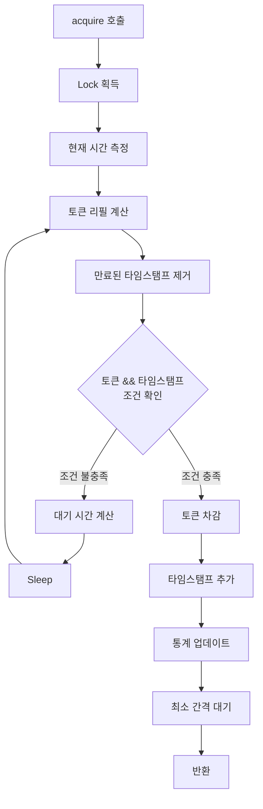

# RateLimiter 클래스 분석 문서

## 개요
RateLimiter는 한국투자증권 API의 초당 호출 제한(20회/초)을 관리하는 클래스입니다.

## 현재 구현 특징

### 1. 하이브리드 접근법
- **Token Bucket**: 토큰 기반 Rate Limiting
- **Sliding Window**: 시간 기반 타임스탬프 추적
- 두 방식을 병행하여 더 엄격한 제한 적용

### 2. 주요 컴포넌트

#### 초기화 파라미터
```python
def __init__(self, max_calls, per_seconds, safety_margin=0.9):
```
- `max_calls`: 시간 윈도우 내 최대 호출 횟수
- `per_seconds`: 시간 윈도우 (초)
- `safety_margin`: 안전 마진 (0.9 = 실제 제한의 90%만 사용)

#### 내부 상태 변수
- `self.tokens`: 현재 사용 가능한 토큰 수
- `self.call_timestamps`: 호출 타임스탬프 큐 (deque)
- `self.refill_rate`: 초당 토큰 리필 속도
- `self.calls_per_second`: 초당 호출 통계 (defaultdict)
- `self.lock`: 스레드 안전을 위한 Lock

### 3. acquire() 메서드 동작 방식



#### 상세 동작 순서:

1. **토큰 리필**
   - 마지막 업데이트 이후 경과 시간 계산
   - `tokens = min(max_calls, tokens + 경과시간 * refill_rate)`
   
2. **슬라이딩 윈도우 정리**
   - 1초 이상 경과한 타임스탬프 제거
   
3. **조건 확인 (두 조건 모두 만족 필요)**
   - Token Bucket: `tokens >= 1`
   - Sliding Window: `len(timestamps) < max_calls`
   
4. **대기 로직**
   - 토큰 부족 시: `(1 - tokens) / refill_rate` 만큼 대기
   - 타임스탬프 초과 시: 가장 오래된 타임스탬프가 만료될 때까지 대기
   
5. **호출 처리**
   - 토큰 1개 차감
   - 현재 타임스탬프 추가
   - 초당 호출 통계 업데이트
   
6. **추가 안전장치**
   - 최소 간격 강제: `per_seconds / (max_calls * 1.2)`
   - 약 69ms 추가 대기 (12회/초 기준)

### 4. 통계 기능

#### get_stats()
- 호출 통계 딕셔너리 반환
- 최대 초당 호출 횟수, 총 호출 횟수 등

#### print_stats()
- 초당 호출 횟수를 시간별로 출력
- 제한 준수 여부 확인

## 문제점 분석

### 1. 과도한 안전장치
- safety_margin (0.9 or 0.8)
- 최소 간격 강제 (1.2배 여유)
- 실제로는 매우 보수적인 호출 패턴

### 2. 슬라이딩 윈도우 vs 고정 윈도우
- 클라이언트: 슬라이딩 윈도우 (현재 시점 기준 1초)
- 서버: 고정 윈도우 추정 (0-1초, 1-2초...)
- 윈도우 경계에서 버스트 발생 가능

### 3. 동시성 처리
- Lock으로 동기화되어 있으나
- ThreadPoolExecutor의 동시 실행이 문제
- acquire() 후 실제 API 호출까지의 지연

### 4. 에러 처리 부재
- EGW00201 에러 발생 시 재시도 메커니즘 없음
- 수동으로 재시도 필요

## 개선 방향

1. **더 정교한 토큰 버킷 구현**
2. **고정 윈도우 시뮬레이션 추가**
3. **에러 발생 시 자동 재시도**
4. **동적 Rate Limit 조정**
5. **배치 처리 최적화** 